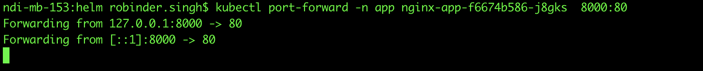
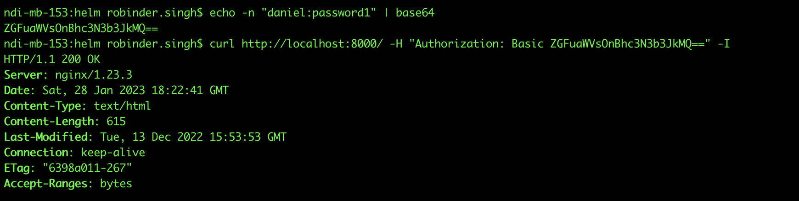
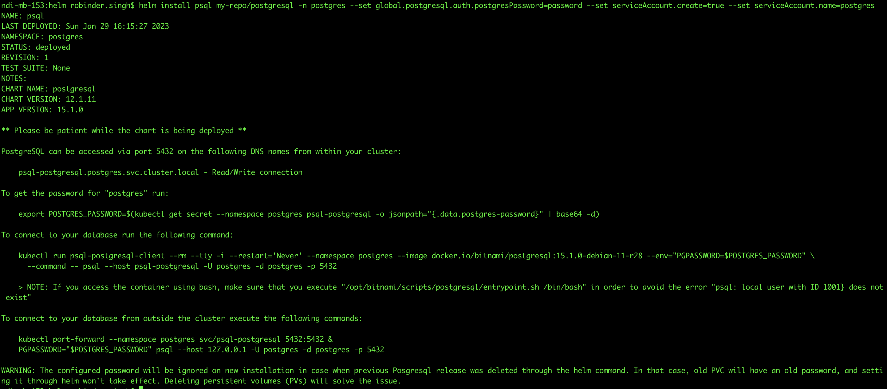
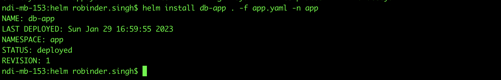

# SOLUTION:

# # TASK 1

Create namespace for application installation
```bash
kubectl create namespace app
```
Create a new namespace for vault
```bash
kubectl create namespace vault
 ```
 Vault installation using helm charts

 Add Hashicorp Helm Repository locally
 ```bash
  helm repo add hashicorp https://helm.releases.hashicorp.com
 ```

 Installing vault on vault namespace
 ```bash
 helm install vault hashicorp/vault -n vault
 ```

 Check if everything is installed correctly
```bash
 kubectl get pods -n vault 
 ```
 Even if the vault is on running state, it is not ready. We need to unseal the vault first.

 Unsealing the vault for the first time

 Let us first get into  the shell inside the vault pod.
```bash
 kubectl exec -ti -n vault vault-0 -- /bin/sh
```
Vault initialize
Let us initialize vault. Doing so, it will provide us 5 unseal keys and a root token which we will use later. This is a one time process and only done for the first
time.

vault operator init

Unseal vault
Now we need to unseal the vault. For this we need to run below three command one by one 
the unseal keys would be the keys that we will get after running vault operator init
```bash
vault operator unseal Unseal key1
```
```bash
vault operator unseal Unseal key2
```
```bash
vault operator unseal Unseal key3
```
We need to put the keys in place of Unseal key 1,Unseal key 2,Unseal key 3

  After unsealing  the vault with 3 unseal keys . If we exec out of the pod and check, we can see that the vault is now in running state.

  Note: We need to unseal the vault everytime the pod is restarted.

  # Creating secrets on vault

  We can do this using the UI as well as CLI. I will port forward my local 8200 to the vault's pod 8200 so that I can use vault from my local machine.
  ```bash
  kubectl -n vault port-forward vault-0 8200:8200
  ```

  Now the vault is accessible on my local machine's port 8200.

  Testing with curl command
  

  # Login into vault using root token

  For logging into vault, first we need to install vault binary on our local machine. If we do not have this, we can exec into the vault pod and run the
  commands from there. But for the ease of access, I recommend following the steps that I have followed which is by downloading a vault binary on local
  machine. I have already installed vault binary on my laptop, I won't be showing this step. Check https://developer.hashicorp.com/vault/docs/install for
  installation guides. Else one can perform all the steps from inside vault pod as vault binary is present there.

  Export vault address, so that vault binary knows where to look for to find Vault server.
  

  Using the root token that i already have during initializing vault.
 

 Now we are all set to run commands.

 # Enable a new KV Secret engine

 We have to create a new secret engine. By default only cubbyhole is present which deals with authentication.

 So, let us create a new KV engine to store our credentials.
 

 I have created kv-v2 which has versioning enabled which stores the older changes if the secret is changed.
 If we look at the UI, we get new secret engine.

 

 # Creating a new secret

 We are all set to create a new secret inside our vault.I used this site  https://wtools.io/generate-htpasswd-online   to generate the password.
You can also use tool htpasswd to create the password.

```bash
vault kv put secret/nginx user1=daniel password1=\$apr1\$ojt5qlc8\$szhEXweRyppr7.HTLibVB1  user2=robin password2=\$apr1\$2zruf69j\$CDMUiXaa9bDlNDr..YZjR/
```

Checking if the secrets are created from the UI


Verifying from vault binary


Everything looks good.

## Kubernetes service account authentication on vault
1. Enabling kubernetes based authentication on vault
Like secrets/ , we have to enable kubernetes engine if we want to login into vault using k8s service accounts.

```bash
vault auth enable kubernetes
```
Now we have to use vault service account token to configure vault with kubernetes. Let us do by execing inside the vault-0 pod.

2. Logging in

We have to login as root user after we get a shell inside the vault-0 pod. Use the root token that we have obtained while initializing the vault for the
first time.


3. Run the following command


This command enables the Kubernetes auth method in vault, and configure it with the necessary information to communicate with the Kubernetes API
server.
4. Creating policy on vault

This allow us to read the secrets that is present on path secret/data/nginx. Since we are using kv-v2, we need to add data too.


Finding this on the UI inside Policies:


5. Creating role that maps the service account to this policy

Now we create a role which maps to nginx service account in app namespace and nginx-policy policy.


This can be found on the UI inside Access -> Kubernetes


# Doing the Nginx Deployment using Helm

We will use nginx.yaml to deploy nginx from the first task.
 

 Validating with curl command
Let us port forward the local port 8000 to port 80 inside the pod so that the nginx server is available from the local machine.



Checking if secrets are mounted on the file


Trying to authenticate without credentials

We get 401 on the response.

Trying to authenticate with daniels credentials



This time we get 200 OK on our HTTP response.

Trying to authenticate with robin


# Summary Task 1
We have deployed nginx on local k8s cluster.
We have deployed vault using helm charts.
we have authenticated to vault using kubernetes service account.
we have injected the secrets that we have created on vault to the nginx deployment to implement basic HTTP authentication.

# # TASK 2

Creating separate namespace for postgres deployment


Postgres Installation


Installing postgres with helm charts



Logging into postgres pod:


Everything looks good.

-  Created Application in python(main.py)  that reads credentials from /vault/secrets/db-creds which will be injected from vault later and uses that as a connection string for postgres.
- If the connection is valid, we get "Connection: Ok" and in case of error we get "Connection: Failed"

Image is build and pushed to my docker repository. Image is available at 

 # Vault database secret engine

 Login into vault

 We use root token that was created on the earlier task to login into the vault.


Enable database secret engine
 - Similar to kubernetes secret engine, we enable the database secret engine.
 

 Configuring now


- We are creating a new connection for database postgres
- Plugin name is predefined for different databases
- Connection_url : While configuring vaults tries to connect to postgres server using the provided credentials , Here I have used kubernetes DNS for
service accounts ( service-name.namespace )
- All (*) roles are allowed. We will be creating roles later on. If you want to allow a single role, mention that here instead of wildcard.
- username and password are just variable that will be used on connection_url

This service can be reachable using DNS on psql-postgresql.postgres:5432

Creating role


- Creating a new role called db-app which when referenced will execute creation_statements SQL commands on the postgres server. For this case will create a new account on postgres with access to all the tables.
- Revocation_statements are executed when the pod dies, and the access is revoked.
- Default_ttl is the value where the leased should be renewed. I have kept this value 5seconds.
- Max_ttl is the value in which the account expires
- In the where kubernetes is integrated with vault, vault itself manages all the leases for the token and sidecar loads the newly created database
credentials inside the pod so that the application does not goes down.

# Configuring access for service account
Now we need to create another role, which allows our service account of the db-app to read the credentials from the database engine. This is something that we have already done while configuring nginx.

Creating policy


With the policy, the service account can ask vault to generate new credentials. database/creds/<rolename>

Creating role

- We create a new role for db-app which bounds service account, namespace as well as policy that we have created earlier.
- With this role, service account db-app on app namespace can ask vault for postgres credentials with role db-app ( database/creds/db-app ) as dbapp-
policy policy is attached to it.

Applying the deployment using Helm



Validation
Checking if the pod is running or not


Port Forwarding


Checking if the db connection is successful


Testing with curl command


Connection is OK everytime

# Exec-ing inside the container

Let us visit the pod and see what is happening inside the /vault/secrets/db-creds file.


- I have read the content of the file db-creds , and output the content into /tmp/test.txt file
- The script has a 4 second sleep as the credentials will expire after 10 seconds and the new user will be created.
- We will find the unique number of entires ont the /tmp/test.txt file after the script is completed.


Checking the content of /tmp/test.txt


